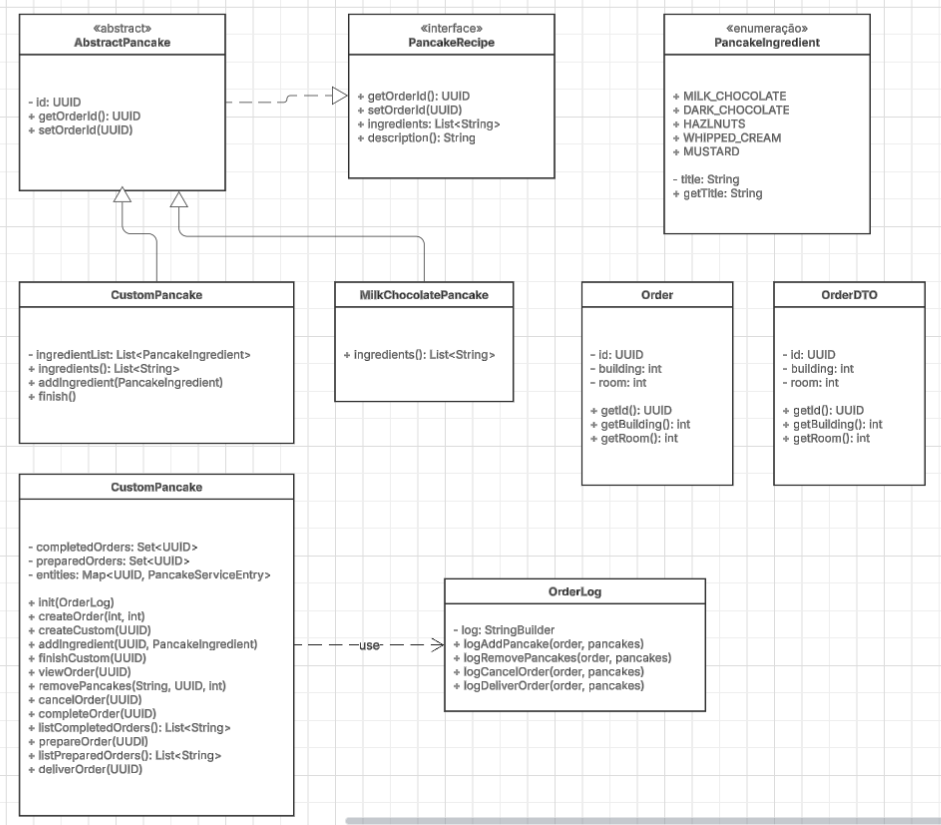

# PancakeLab

# Initial code analysis

## Model classes

### Abstract

Let's start with the model layer of the project. The `PancakeRecipe` interface doesn't have an abstract class, for example `AbstractPancakeRecipe`, causing all classes that implement this interface to repeat a minimum field `UUID id`.

### UUID Field

The class hierarchy of `PancakeRecipe` presents a duplication problem in the `UUID id` field. Derived classes that use `extends` end up inheriting this field, but also declare it again, resulting in multiple instances of the same identifier.

For example, the class `DarkChocolateWhippedCreamHazelnutsPancake` inherits from `DarkChocolateWhippedCreamPancake`, which in turn inherits from `DarkChocolatePancake`. As each of these classes declares its own `UUID id` field, the final class ends up with three identical fields instead of a single identifier.

This redundancy represents a flaw in the architecture design, which could be solved with an abstract base class that declares the `UUID id` field only once, eliminating the need for repetition in subclasses.

### UUID

Using UUID as an identifier in a server presents important advantages and disadvantages:

Advantages:

- Generation of globally unique identifiers without the need for central coordination
- Ideal for distributed systems where multiple servers can create records simultaneously
- Offers timeless and consistent identifiers for exposure to clients

Disadvantages:

- Can cause greater fragmentation in the database when compared to sequential IDs
- Doesn't have natural temporal ordering, making it difficult for queries based on creation sequence
- Occupies more storage space (16 bytes vs. 4-8 bytes of an integer)

### Absence of basic methods

For model classes, it's usually good practice to implement the methods `toString()` and `equals()`, to facilitate debugging and checking object equality based on their content. However, this is not a mandatory requirement.

## OrderLog Class

Classes of `log` are very important for recording events in a timeline, and can serve for some type of audit or for debugging problems that have occurred. Due to its importance, this class could be better constructed.

### Problems with Singleton

The first problem found is the fact that it is a `singleton` that is not protected in the isolation of environment between tests, nor does it have adequate control of its life cycle during test execution.

### Implementation Limitations

The second problem is in the implementation of the `singleton` pattern, which uses a `static` field. This approach does not allow controlling the number of instances, limiting itself to a single one per JVM instance. An example of a situation where multiple instances would be necessary is when using the `decorator` pattern to log to different destinations simultaneously: console, file, and for critical error logs, sending to a notification service for administrators.

### Concurrency

A third problem is that the current implementation is not `thread-safe`. When multiple threads execute logging operations simultaneously, content mixing can occur, as the `StringBuilder log` field is not safe for concurrent use. It would be more appropriate to use `synchronized` on the relevant methods or replace with `StringBuffer`, which offers safety for concurrent operations.

### Log Classification

Finally, although having specific methods for each type of log can facilitate classification, this approach has limitations. It is not always possible to classify all events within predefined categories, making it necessary to have a generic method to record unclassified logs. Depending on the number of possible log types, exhaustive classification can become impractical and difficult to maintain.

## PancakeService Class

The `PancakeService` class presents several opportunities for improvement in its architecture and implementation:

### Separation of Responsibilities

One of the main observations is the need to separate the responsibility of data storage from business logic. Creating a dedicated `PancakeStorage` class would allow the `PancakeService` to focus exclusively on business rules, following the Single Responsibility Principle (SRP).

### Concurrency and Thread Safety

The current implementation is not `thread-safe`. All fields and methods lack mechanisms that ensure safe execution in a concurrent environment. Considering that order systems typically receive multiple simultaneous requests, this is a critical improvement.

### Memory Management

Although this is a didactic exercise with reduced scope, it's worth mentioning that the `completedOrders` list indefinitely accumulates all orders placed. In a real system, this could lead to excessive memory consumption problems, even considering that `UUID` objects are relatively small.

### Transaction Isolation

The system does not implement mechanisms to ensure transaction isolation when errors occur. In a production system, it would be necessary to implement rollbacks to maintain data consistency.

### Search Optimization

The current implementation uses `stream` to search for orders by ID, which is inefficient for frequent operations. A significant improvement would be to implement a `Map<UUID, PancakeServiceEntry> entities`, which would optimize the performance of methods such as `removePancakes`, `cancelOrder`, `viewOrder`, and `deliverOrder` in a single structure that stores the data of an `Order`.

### Error Handling

The `add` methods, such as `addDarkChocolatePancake`, throw non-specific exceptions when they receive an invalid `UUID orderId`, through the `Optional.get()` method. This makes problem investigation difficult, as it does not provide adequate contextual information about the error.

### Dependency Injection

The service would benefit from an approach based on dependency injection, receiving `storage` and `logger` through the constructor. This would facilitate isolation for testing and improve separation of responsibilities.

### Logging Redundancy

The `cancelOrder` method makes duplicate `log` calls, which generates redundant entries in the records.

### Return Type

The `deliverOrder` method returns a non-specific type, making it difficult for API consumers to use, as they don't have information about the type, number of cells, or semantics of the return. A well-defined interface or return class would significantly improve usability.

### RemoveIf for Set

In this context of `completedOrders` and `preparedOrders`, some examples were found such as `completedOrders.removeIf(u -> u.equals(orderId))`, which doesn't make sense, because the field is a `set` and it is not necessary to iterate to remove the element, changing to `completedOrders.remove(orderId)`.

# Modification proposal

It is proposed to create an `AbstractPancakeRecipe` class with the `UUID id` field that implements the `PancakeRecipe` interface, providing the `get/set` methods for the `orderId`.

In the `PancakeService` class, it is suggested to implement an internal class called `PancakeServiceEntry` that stores the configuration of an `Order` associated with a `UUID`. This approach eliminates the need for multiple `Map<UUID, ...>`.

Still in the `PancakeService` class, it is recommended to create the utility methods `entryOrNull` and `entryOrThrow` that query the new `Map<UUID, PancakeServiceEntry>` and, if they don't find the entry, return `null` or throw an `error`, respectively.

To avoid unwanted modifications to internal fields, methods such as `PancakeService.listCompletedOrders()` should be changed to return a copy of the field, instead of the direct reference to the internal field.

## Concurrency

Here are some proposals for improving concurrency in the `PancakeService` class.

The first proposal is to add `synchronized` to all methods. The second is to use fields with `thread-safe` instances. The last proposal is to implement protection against reading and writing through the `ReadWriteLock` with `fair=true`.

In the concurrency aspect, the fields of the `PancakeService` class have distinct concern characteristics. As this is a didactic project aimed at exercising knowledge, I will use more appropriate classes for each type of concurrency. However, in non-critical or low-concurrency projects, the simplest solution may be more appropriate, considering the context of code simplicity and its elaboration.

The service class has two sets of fields. The first set, `completedOrders` and `preparedOrders`, are mutually exclusive, making no sense for an `order` to be in both simultaneously, and can use `completedOrders` as a `mutex` for synchronization. The second set, `entities`, can simply be a `thread-safe` structure, such as `ConcurrentHashMap`.

The first improvement proposal is to add `synchronized` to all external service methods to ensure that every operation is atomic. This proposal uses the native JVM resource to perform synchronization in contexts where the frequency of read and write operations are similar.

The second proposal is to use the `ReadWriteLock` interface to protect critical regions of write and read operations. Its advantage is to privilege concurrent read operations while making write operations exclusive. For services with many reads and few writes, this solution is appropriate. Outside of this context, performance can be compromised, as this structure is heavier than `synchronized`.

The third proposal is to use a `mutex` to protect the state of `completedOrders` and `preparedOrders`, and the `ConcurrentHashMap` for the `entities` field. This approach ensures `thread-safety` with superior performance to the other proposals. The negative point is the non-atomicity of operations. Still, the service remains `thread-safe` by being protected against concurrent access, maintaining coherence in internal fields.

Therefore, the best proposal will depend on the service usage context. For this didactic example, the ideal solution would be to combine the first and third proposals.

Instead of applying `synchronized` to the method (on `this`), I will use `synchronized` on the `PancakeServiceEntry` instance. This will allow concurrency when the `UUID` is different, but will ensure exclusive execution when it is the same. This approach ensures atomicity for the same `UUID` and allows concurrency when they are different, with fields protected by `thread-safe` structures such as `ConcurrentHashMap` and `mutex` of `completedOrders`.

The `PancakeServiceEntry.custom` field does not need to be declared as `volatile` because it will be accessed within a `synchronized` block, at which time the `thread-memory` is synchronized with the `global-heap`. Considering that the service can come from a web server and reference the `PancakeServiceEntry` object in different threads, it is important that the field is stored in the global heap. The `recipes` field is already a `thread-safe` list, dispensing with this special attention.

## Building recipes via API

To avoid creating fixed recipes in the project, the previous ones were maintained and some methods were developed in the `api` for building `CustomPancake` through method calls, instead of using the `builder` pattern. The execution flow consists of three stages: first calling the `create` method, then the `add` method, and finally the `finish` method. This process allows creating custom recipes using ingredient enumerators.

## DTO

The objects used internally should not be exposed to those who use the API. The DTO pattern solves this problem by ensuring that the input and output data of the service are always non-internal objects. For each logical class of the service that needs to be exported outside the API or used as a parameter, there should be a corresponding DTO, ensuring the isolation of the data model used within the service.

The `Order` and `OrderDTO` classes are very similar, but the role of the `dto` is to ensure the isolation of the data model class, offer flexibility in the form of representation, and control what can be exposed to the API user.

## TDD

The TDD proposal is to build code based on tests, from the beginning of the class to its complete construction, creating tests for each stage of the process. Thus, for each stage of component construction, first the test is built, it is left red (broken) and then the necessary code is implemented to make it pass, also ensuring the functioning of the other tests already created.

## UML

## Validation

For service methods, the first step is to validate the input parameters. For example, a crucial parameter to be validated is the Order, verifying the existence of the `PancakeServiceEntry`.

# Problem

## Description
Our Coding Dojo uses Pancake Lab, a pancake shop software solution for ordering pancakes.
The software solution can be used to order pancakes to the disciples' rooms and also
by the Sensei's Chef and Delivery service to prepare and deliver the pancakes.

### Use case
1. In the first step the Disciple creates an Order and specifies the building and the room number.
2. After that the Disciple can add pancakes from the menu.
3. The Disciple can choose to complete or cancel the Order, if cancelled the Order is removed from the database.
4. If the Disciple completes the Order the Chef can prepare the pancakes.
5. After the Chef prepares the Order it can be delivered.
6. After the Order is sent for delivery it is removed from the database.

## Problem statement
At first all was well but soon Disciples started to demand various kinds of pancakes that the application
didn't support or anyone could ever imagine.
The evil Dr. Fu Man Chu, the main Villain fighting the Sensei in an endless confrontation, took the chance
to bring havoc against his hated Dojo.
He hacked the system to add mustard with milk-chocolate and whipped cream pancake.
Some errors were also reported, disciples reported that pancakes were missing, delivery reported that they were
sent to a building that does not exist, etc.

## Assignment
The Sensei proposed that the application should be refactored. You, his best Disciple, have been tasked
to save the pancakes production in the Dojo.

The Sensei has put forth some conditions:
- the solution should be based on Object-oriented programming
- TDD should be followed
- the solution and the client API should be based on pure Java only, without usage of any frameworks and/or external dependencies
- the API should not expose any internal domain objects to its callers
- the solution should avoid hardcoded recipes
- disciples should not use builders to create pancakes and pass them to the API, they should be able to add ingredient after ingredient to the pancake through the API
- input data should be validated
- possible data-race issues should also be addressed
- documentation in the form of UML diagrams would be beneficial

Start now your assignment and save the Dojo.